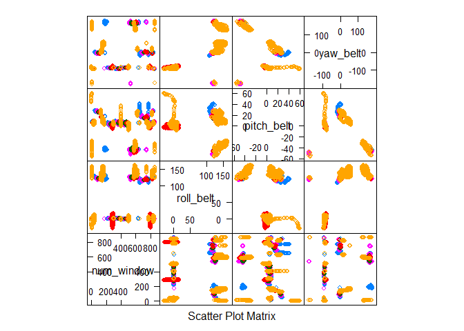

# Practical Machine Learning Course Project
# Assignment: Prediction
## Instructions
One thing that people regularly do is quantify how much of a particular activity they do, but they rarely quantify how well they do it. In this project, your goal will be to use data from accelerometers on the belt, forearm, arm, and dumbell of 6 participants.
The goal of your project is to predict the manner in which they did the exercise. This is the "**classe**" variable in the training set. You may use any of the other variables to predict with. You should create a report describing how you built your model, how you used cross validation, what you think the expected out of sample error is, and why you made the choices you did. You will also use your prediction model to predict 20 different test cases.

## Background
Using devices such as Jawbone Up, Nike FuelBand, and Fitbit it is now possible to collect a large amount of data about personal activity relatively inexpensively. These type of devices are part of the quantified self movement - a group of enthusiasts who take measurements about themselves regularly to improve their health, to find patterns in their behavior, or because they are tech geeks. One thing that people regularly do is quantify how much of a particular activity they do, but they rarely quantify how well they do it. In this project, your goal will be to use data from accelerometers on the belt, forearm, arm, and dumbell of 6 participants. They were asked to perform barbell lifts correctly and incorrectly in 5 different ways. 


### Load caret package and data training file

```r
library(caret)
train <- read.csv("pml-training.csv")
```

### Exploration and dimension reduction
I reduce training data to columns with complete records (and ignore dates, names, record numbers)

```r
training <- train[,c(7:11,37:49,60:68,84:86,102,113:124,151:160)]
```

I do some featurePlots to see which variables do not have some correlation with classe, from a visual perspective. I show only plot here for brevity.

```r
featurePlot(x=training[,1:4], y=training$classe, plot="pairs")
```

<!-- -->

I see that "*num_window*" is unimportant so it is removed.

```r
training <- train[,c(8:11,37:49,60:68,84:86,102,113:124,151:160)]
```

I found that performing *Random Forest* seach with all remaining 53 variables is computationally expense, so I see if I can reduce the number of variables by checking variable correlations. I found that with a threshold correlation of 0.90, I was able to eliminate 7 variables and retain very high accuracy.This decreased subsequent computing time and the likelihood of overfitting.

```r
corrs <- abs(cor(training[,-52]))
diag(corrs) <- 0
which(corrs>0.90, arr.ind=TRUE)
```

```
##                  row col
## total_accel_belt   4   1
## accel_belt_y       9   1
## accel_belt_z      10   1
## accel_belt_x       8   2
## roll_belt          1   4
## accel_belt_y       9   4
## accel_belt_z      10   4
## pitch_belt         2   8
## roll_belt          1   9
## total_accel_belt   4   9
## accel_belt_z      10   9
## roll_belt          1  10
## total_accel_belt   4  10
## accel_belt_y       9  10
## gyros_arm_y       19  18
## gyros_arm_x       18  19
## gyros_dumbbell_z  33  31
## gyros_forearm_z   45  31
## gyros_dumbbell_x  31  33
## gyros_forearm_z   45  33
## gyros_dumbbell_x  31  45
## gyros_dumbbell_z  33  45
```

```r
# Down to 46 variables for training set!
training <- training[,-c(4,8,9,10,19,33,45)]
```
Therefore I omit the variables : "total_accel_belt", "accel_belt_x", "accel_belt_y", "accel_belt_z", "gyros_arm_y", "gyros_dumbbell_z", "gyros_forearm_z".


### Create training and cross-validation data
I retain **70% for training for 30% for testing (cross-validation).**

```r
inTrain = createDataPartition(training$classe, p = 0.7)[[1]]
trainset = training[ inTrain,]
crossset = training[-inTrain,]
```

### Modelling
I initially wanted to *stack Random Forest and a Gradient Boost Models*; however, I found that generating a Gradient Boost model was computationally expensive (even when I reduced the number of variable to 32). Ultimately, I used a **Random Forest with 46 variables**.

```r
set.seed(62433)
# Random Forest
modfitRF <- train(classe ~ ., method="rf", data=trainset)
confusionMatrix(crossset$classe, predict(modfitRF,crossset))
```

```
## Confusion Matrix and Statistics
## 
##           Reference
## Prediction    A    B    C    D    E
##          A 1673    1    0    0    0
##          B   10 1125    4    0    0
##          C    0    7 1015    4    0
##          D    0    0    7  955    2
##          E    0    1    1    2 1078
## 
## Overall Statistics
##                                          
##                Accuracy : 0.9934         
##                  95% CI : (0.991, 0.9953)
##     No Information Rate : 0.286          
##     P-Value [Acc > NIR] : < 2.2e-16      
##                                          
##                   Kappa : 0.9916         
##  Mcnemar's Test P-Value : NA             
## 
## Statistics by Class:
## 
##                      Class: A Class: B Class: C Class: D Class: E
## Sensitivity            0.9941   0.9921   0.9883   0.9938   0.9981
## Specificity            0.9998   0.9971   0.9977   0.9982   0.9992
## Pos Pred Value         0.9994   0.9877   0.9893   0.9907   0.9963
## Neg Pred Value         0.9976   0.9981   0.9975   0.9988   0.9996
## Prevalence             0.2860   0.1927   0.1745   0.1633   0.1835
## Detection Rate         0.2843   0.1912   0.1725   0.1623   0.1832
## Detection Prevalence   0.2845   0.1935   0.1743   0.1638   0.1839
## Balanced Accuracy      0.9969   0.9946   0.9930   0.9960   0.9987
```
It can be seen that the Random Forest model provides **accuracy of 0.9934** with the testing set, and I received a 100% score on the 20-question final quiz.
